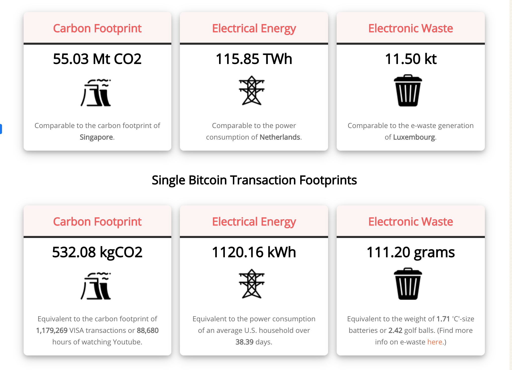
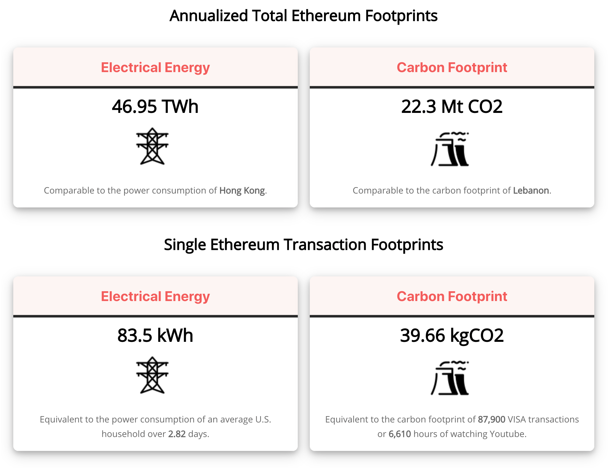

# xDai Energy Efficiency

In this article we present an overall energy usage overview \(provided by [Lab10Collective](https://lab10.coop/)\) of different blockchains as well as VISA. The data shows that the xDai chain is extremely efficient while providing fast block times and a scaleable infrastructure. 


This overview was done in 2020. In 2021 Energy Consumption for both Bitcoin and Ethereum has increased dramatically.


## Energy Usage Overview

Energy usage equivalents \(number of average US households consume the same amount of energy as the following chains/Visa\). Note this figure is for 2020, **energy usage has increased dramatically for Ethereum and Bitcoin in 2021**.

| Chain / System | \# of US Households |
| :--- | :--- |
| Bitcoin | **5,250,408** 🏘 🏘 🏘 🏘 🏘 🏘 🏘 🏘 🏘 🏘 🏘 🏘 🏘 🏘 🏘 🏘 🏘 🏘 🏘 🏘 .......... |
| Ethereum 1.0 | **721,223** 🏘 🏘 🏘 🏘 🏘 🏘 🏘 🏘 🏡 🏡 🏡 🏡  |
| Visa | **42,702** 🏘 🏘 🏘 🏡 🏡  |
| Ethereum 2.0 _\*speculated_ | **2,704** 🏡  |
| xDai Chain | **2.1** 👯♂  |
| Artis | **0.8** 🕴  |

## Bitcoin Footprints

A frequently mentioned concern about blockchain technology is energy consumption. Bitcoin is known to use incredible amounts of energy.  The annual footprint is alarming. 

Ethereum currently consumes much less energy, but it is still equivalent to the energy needed to power 721,223 US homes. [https://digiconomist.net/ethereum-energy-consumption](https://digiconomist.net/ethereum-energy-consumption). This will change with Ethereum 2.0\*

Large centralized companies like VISA can process many transactions per second and require less energy: 42,702 US households. Keep in mind, however, this is just for transaction processing, not all of the power that VISA uses for things like offices, travel, banking infrastructure etc. Not to mention they are a giant centralized corporation that charges high transaction fees.

## xDai Chain Efficiency

[lab10Collective](https://lab10.coop/%20), a project dedicated to a sustainable energy economy and also an xDai validator, recently ran comparison data for their [Artis Chain](https://artis.eco/) and the xDai chain relative to other transaction processing chains/systems. They found that ARTIS and xDai are extremely efficient, consuming far less power than other chains as well as payment processing giant VISA. 

Efficiency is based on the number of operating nodes, hardware requirements, and TPS \(Transactions per second\) capacity.

The energy consumption required to run the ARTIS is equivalent to 0.8 US households annually. For xDai it is 2.1 households.  ARTIS is ~ 600x more efficient than Visa, and **xDai 300x+ more efficient than VISA**.

Visa does have a much higher TPS \(7896 max vs 119 max for xDai\) at them moment. If required however, xDai can scale to offer more TPS through bridging \(horizontal scalability\) or node improvements \(vertical scalability\). These solutions would slightly increase energy requirements, but these increases would be minor relative to VISA or POW blockchains. In addition, [HoneyBadger BFT](../../for-validators/consensus/honeybadger-bft-consensus/) consensus will improve the TPS to 476 without vastly increasing the energy consumption per TX.

xDai is extremely efficient, and further decentralization with public POSDAO will improve security and usefulness for the chain.   

## Energy Consumption Statistics

_Stats provided by Artis. Note that TPS capacity is the absolute max capacity with simple Txs, the actual TPS is considerably lower._

<table>
  <thead>
    <tr>
      <th style="text-align:left">TX Processor</th>
      <th style="text-align:left">TPS Capacity</th>
      <th style="text-align:left">Tx / Yr</th>
      <th style="text-align:left">Energy Consumption kWh</th>
      <th style="text-align:left">Wh/Tx</th>
      <th style="text-align:left">Wh/Tx Compared to Visa</th>
      <th style="text-align:left">avg. # of US households</th>
    </tr>
  </thead>
  <tbody>
    <tr>
      <td style="text-align:left">Visa</td>
      <td style="text-align:left">7896</td>
      <td style="text-align:left">249,000,000,000</td>
      <td style="text-align:left">444,063,000</td>
      <td style="text-align:left">1.7834</td>
      <td style="text-align:left"></td>
      <td style="text-align:left">42,702</td>
    </tr>
    <tr>
      <td style="text-align:left">Bitcoin</td>
      <td style="text-align:left">3.5</td>
      <td style="text-align:left">109,500,000</td>
      <td style="text-align:left">56,700,000,000</td>
      <td style="text-align:left">517,808.2192</td>
      <td style="text-align:left">290351x worse
         &#x1F6D1;</td>
      <td style="text-align:left">5,452,447</td>
    </tr>
    <tr>
      <td style="text-align:left">Ethereum</td>
      <td style="text-align:left">34</td>
      <td style="text-align:left">1,072,653,061</td>
      <td style="text-align:left">7,500,000,000</td>
      <td style="text-align:left">6,992.0091</td>
      <td style="text-align:left">3921x worse
         &#x1F6D1;</td>
      <td style="text-align:left">721,223</td>
    </tr>
    <tr>
      <td style="text-align:left">Ethereum 2.0*</td>
      <td style="text-align:left">2177</td>
      <td style="text-align:left">68,649,795,918</td>
      <td style="text-align:left">28,119,600</td>
      <td style="text-align:left">0.4096</td>
      <td style="text-align:left">4x better
         &#x2705;</td>
      <td style="text-align:left">2,704</td>
    </tr>
    <tr>
      <td style="text-align:left">xDai</td>
      <td style="text-align:left">119</td>
      <td style="text-align:left">3,754,285,714</td>
      <td style="text-align:left">21,900</td>
      <td style="text-align:left">0.0058</td>
      <td style="text-align:left">306x better &#x2705;</td>
      <td style="text-align:left">2.11</td>
    </tr>
    <tr>
      <td style="text-align:left">ARTIS</td>
      <td style="text-align:left">95</td>
      <td style="text-align:left">3,003,428,571</td>
      <td style="text-align:left">8,760</td>
      <td style="text-align:left">0.0029</td>
      <td style="text-align:left">
        
611x better

        
&#x2705;

      </td>
      <td style="text-align:left">0.84</td>
    </tr>
    <tr>
      <td style="text-align:left">HBBFT</td>
      <td style="text-align:left">476</td>
      <td style="text-align:left">15,017,142,857</td>
      <td style="text-align:left">52,560</td>
      <td style="text-align:left">0.0035</td>
      <td style="text-align:left">
        
510x better

        
&#x2705;

      </td>
      <td style="text-align:left">5.1</td>
    </tr>
  </tbody>
</table>


\*Ethereum 2.0 will greatly reduce the Ethereum environmental footprint, although not enough is yet known to determine the total efficiency of the network. Numbers provided here are purely speculative. Lab10 estimates Eth2 will be similar to VISA in regards to energy consumption for transactions, but much more open and decentralized.  Also, VISA uses much more energy to fund their corporate enterprise vs minimal energy for a decentralized blockchain.


