# Circles UBI

Circles is a basic income made to promote local economies. CRC tokens are minted daily on the xDai chain for members who can use and trade them within their communities.

* Learn More at [https://joincircles.net/](https://joincircles.net/)
* The UBI application is here: [https://circles.garden/](https://circles.garden/)
* Article about Circles and xDai: [https://www.coindesk.com/circles-ubi-guide-ethereum-xdai](https://www.coindesk.com/circles-ubi-guide-ethereum-xdai)


Once you create an account you will need 3 people who are already participating in Circles to verify it. This can be a challenge, but as the platform grows it will become easier. It does make sense to ask people you know to verify you, and there are more methods and tips on the Circles Telegram Channel at [https://t.me/CirclesUBI](https://t.me/CirclesUBI)


## Get Started

1\) Go to [https://circles.garden/](https://circles.garden/) and click on Sign up. If you already have an account, click login to enter your 24 word seed phrase.

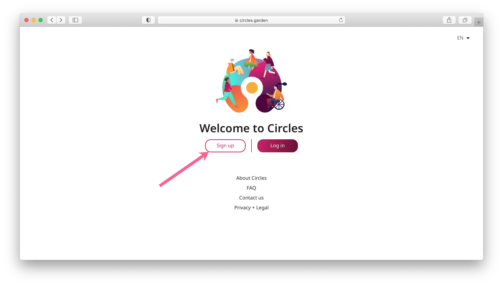

2\) Read the basics and click Next to proceed.

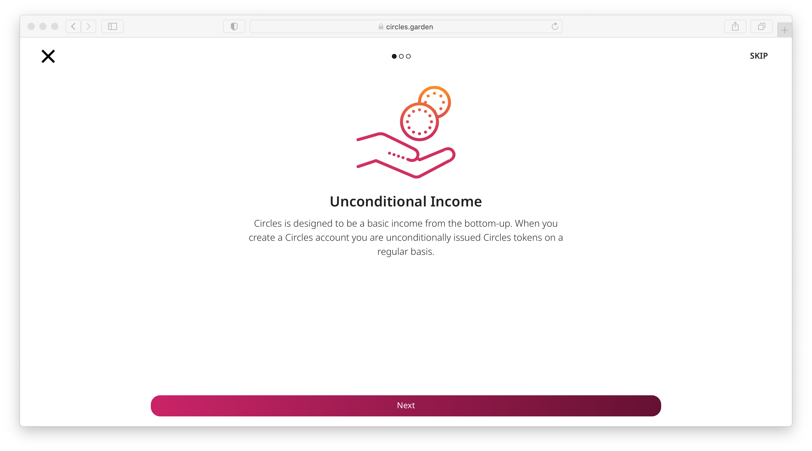

3\) Enter a username, then an email. Once done, you will be presented with a seed phrase. 


**Save your seed phrase in a safe place! Account details are stored locally, and if you clear local storage you will need this to log back into your account.**


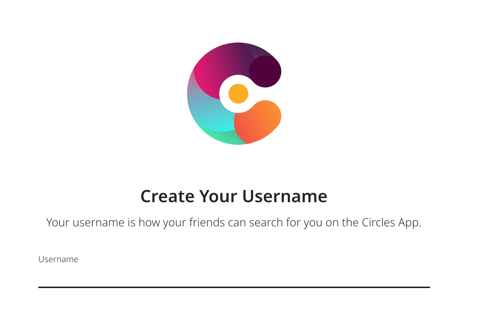

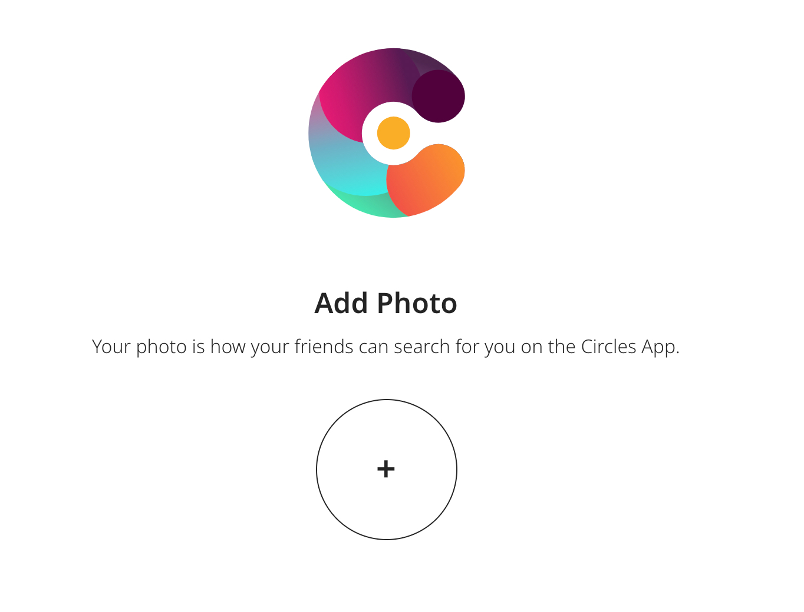

4\) Once your account is created, you will need to be verified through a trust process. Share your link with others who are already verified and whom you trust in the community.

## Trusting Others after Verification

1\) Click on someone who has already trusted you, or search for someone you know by username. Click on the icon next to their profile picture.

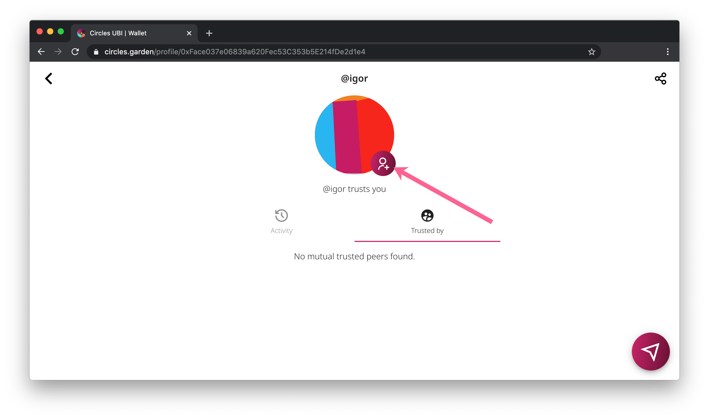

2\) Verify your trust. It makes sense to verify only those who you know and would like to transact with in real life. [More info here in the Trust Network section](https://joincircles.net/faq).

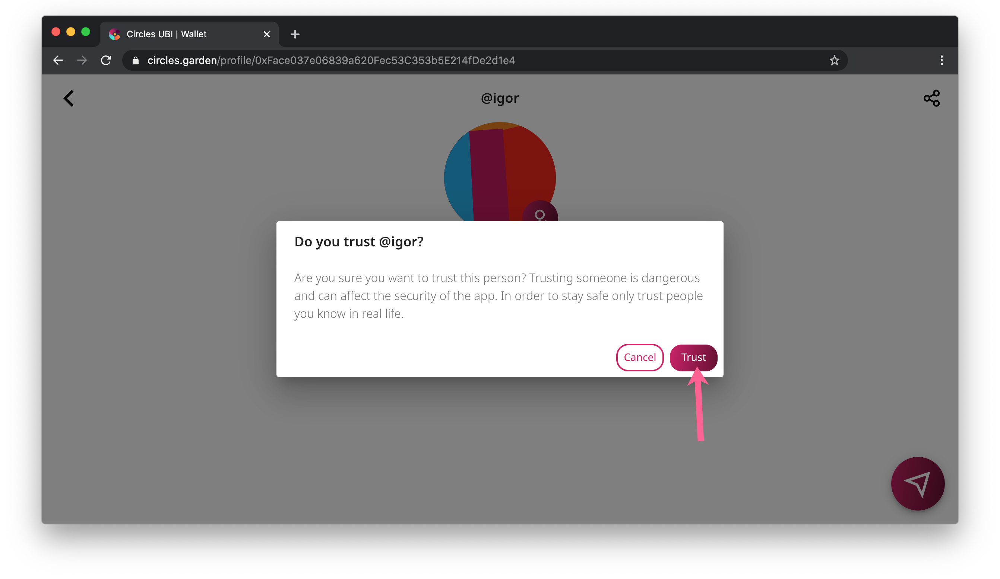

## Sending Circles

You can send an amount of CRC to as a payment for goods and services to people in your immediate circle of trust as well as to their trusted circles. The amount you can send is limited based on what you've earned and what you've already sent.

1\)  Select **Send Circles** in the navigation bar.

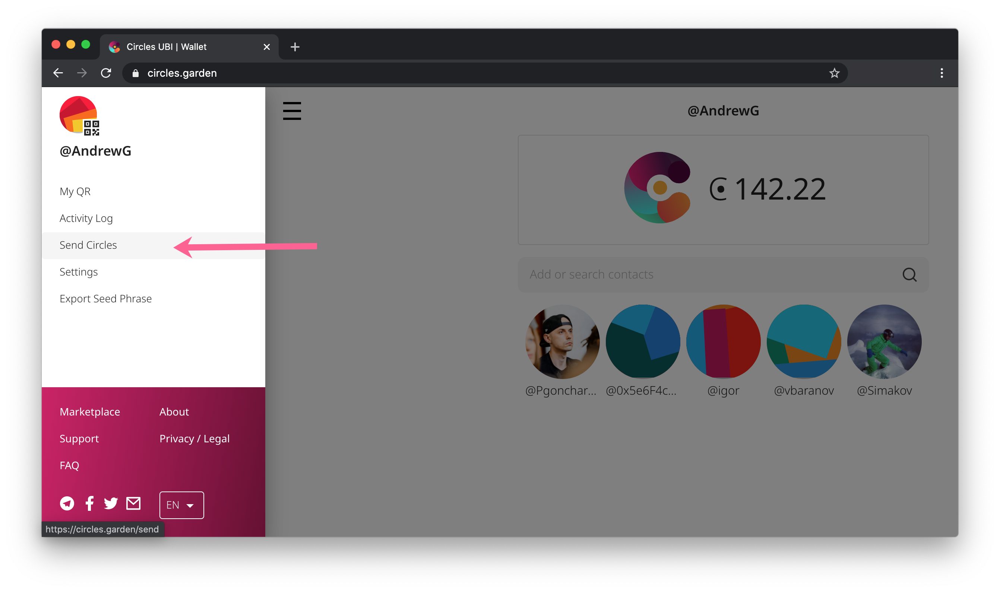

2\) Enter in the amount and an optional note and click send.

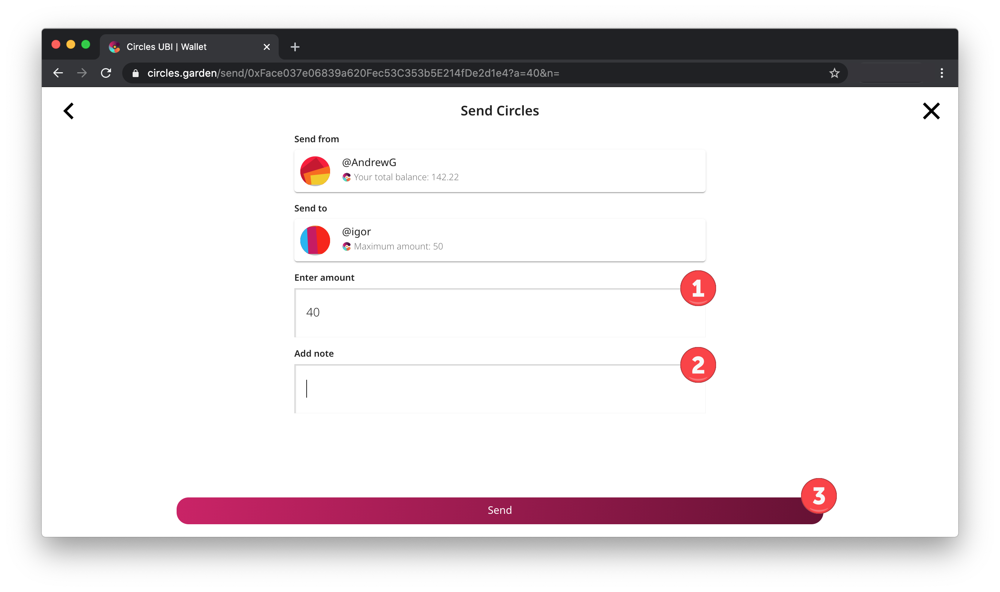

3\) To view previous transactions, both inward and outward bound, select **Activity Log** in the navigation menu. 

## Viewing your Circles Account in BlockScout

BlockScout block explorer has integrated a Circles theme for contracts related to Circles interaction. This includes all user accounts. 

1\) Navigate to **Settings**.

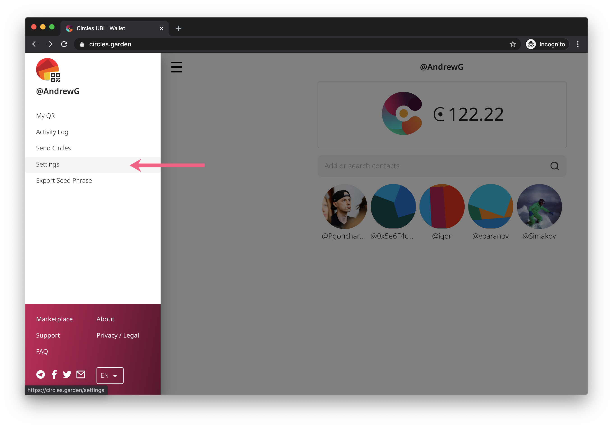

2\) Click on **Profile address**.

3\) In BlockScout you can view many metrics about your account such as transactions you've sent and received and other information.

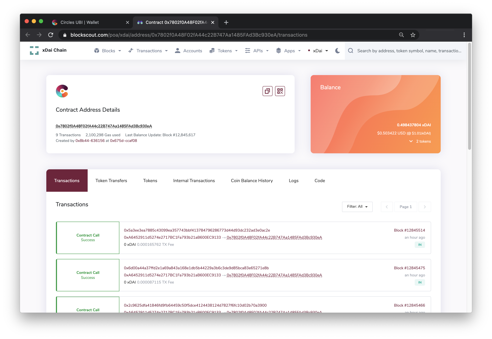

4\) For example, in the **Token Transfers** tab you can view the details related to a recent CRC transaction. Click on the tx hash to see specific details.

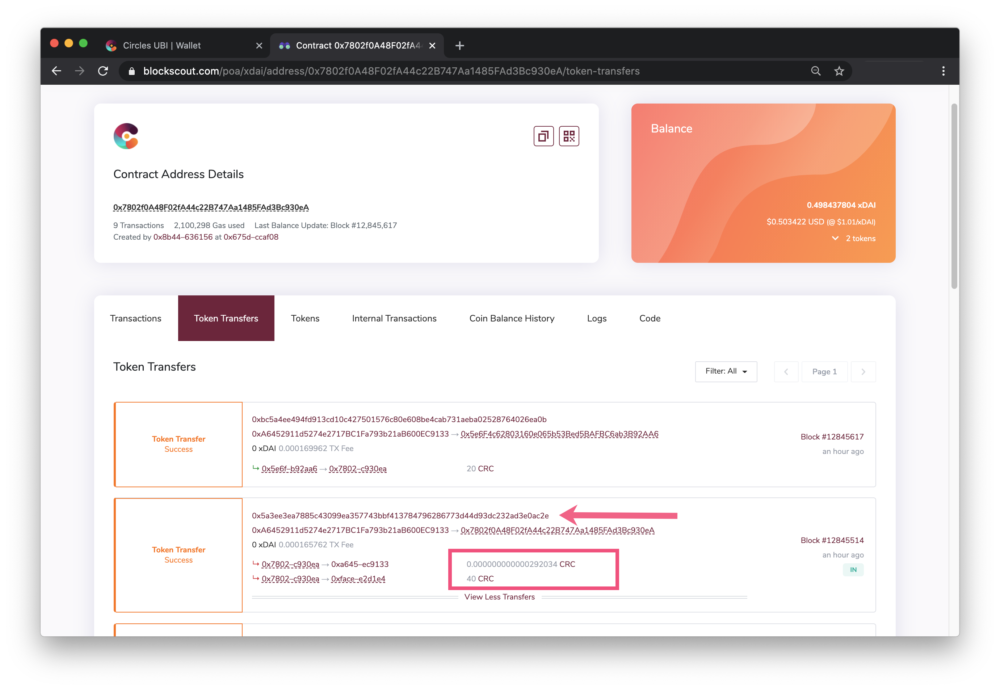

5\) Select the **Tokens** tab to see your current CRC holdings. Each account has a unique CRC token, so you can see that 20 tokens have been sent to you from another user \(1\) as well as your own 102.22 native CRC UBI tokens \(2\).

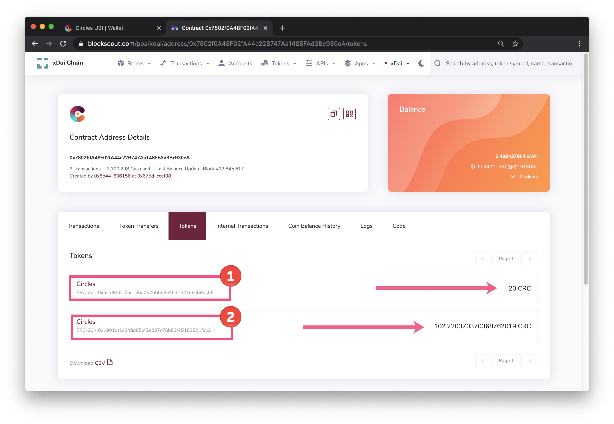

