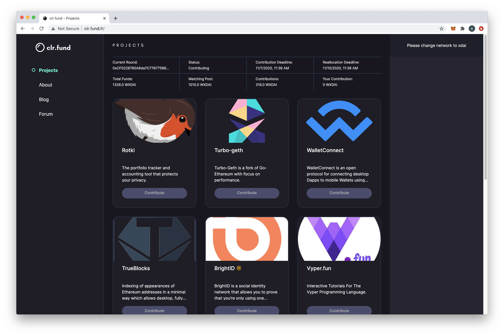

# CLR Fund

[clr.fund](http://clr.fund/) is a protocol for efficiently allocating funds to public goods. Funding is designed to benefit the Ethereum Network based on community preferences. 

Their first matching round is now live on xDai! This launch is a primary test of the contracts with a whitelisting feature. Future iterations will include [brightID ](https://www.brightid.org/)and [Kleros](https://kleros.io/) integrations.


**More Info on CLR Fund**

* [UI on xDai](clr-fund.md)
* [Twitter](https://twitter.com/clrfund)
* [Constitution](https://github.com/clrfund/constitution)


We asked [Auryn Macmillan](https://twitter.com/auryn_macmillan), a primary project contributor, a few questions about the clr.fund. 

## **Tell us about the clr.fund team.**

Really, it's more of a community than a team.

We organize in [Telegram](http://t.me/clrfund), our [forum](https://forum.clr.fund/), and on [Github](https://github.com/clrfund), and use [a colony](https://colony.io/colony/clr) to reward contributors.

It's very much an open contribution environment. If you want to contribute something, jump in and start doing it and the colony will happily reward good work.

We're grant funded by [Moloch](https://www.molochdao.com/) and [Gitcoin grants](https://gitcoin.co/grants/?). Soon to be funded by our own QF rounds, assuming people like what we've built.

## **What ecosystem issues interest you?**

clr.fund was created to help fund Ethereum's public goods.

## **What problems does clr.fund address, and why is it needed?** 

clr.fund was born of a realization that allocating protocol level funding requires a fund allocation protocol.

Mining rewards, for example, are distributed by the protocol, not by a grants committee.

If we want to fund the rest of the ecosystem with L2 fees, anonymous or DAObased philanthropic contributions, and even \(dare I say\) block rewards, then we need a protocol to allocate these funds.

clr.fund aims to be that protocol.

## **What is the project's current status?**

We're a few days into our first real-money test round. You can check out the contracts on xDai here.

The address for this round is: [0xCF0228760A6da7C77677588314B3f87966cd76D8](https://blockscout.com/xdai/mainnet/address/0xCF0228760A6da7C77677588314B3f87966cd76D8/transactions)

The address for the matching pool is: [0x7C2b7832363b6d0Bd0AEF764aA09b66F4da06D61](https://blockscout.com/xdai/mainnet/address/0x7C2b7832363b6d0Bd0AEF764aA09b66F4da06D61/transactions)

## **Who is clr.fund designed for?**

It's designed for anyone who self-identifies as part of the Ethereum community and wants to support its public goods.

## **What are some challenges and successes you've seen so far?**

We're building on bleeding-edge technology with MACI, BrightID, Kleros, Ethereum, and xDai, so the biggest challenges have been building on top of moving targets. 

That said, clr.fund wouldn't be possible without the work that a ton have people have put into those projects. ❤️

Plus it's cool to be able to say things like "You’ve contributed to the first ever \(almost\) permissionless quadratic funding round!".

Being grant funded, so we can maintain credible neutrality, has also been a challenge. But Moloch, Gitcoin grants, and the EF have really helped us along the way.

## **Where are things headed? What are the project goals and roadmap for the rest of the year, and next year?** 

The rest of the year will involve a series of subsequent test rounds as we roll out the rest of the pieces \(BrightID, Kleros, etc\) and continue to make improvements.

If everything happens super smoothly, we could get to mainnet production rounds by late this year or early next year.

We are planning to migrate to mainnet for our production rounds, but there are obviously gas implications for which we are yet to implement solutions. That said, there's no reason that the xDai instance can't live on in parallel, perhaps it could transition to supporting xDai public goods once the canonical clr.fund instance migrates back to mainnet.

## \*\*\*\*🙏 **Thanks Auryn! We are excited to follow the project and support Ethereum development and funds allocation! Anything else to add?**

One last thing I wanted to point out is clr.fund's constitution. It really gives a great overview of what clr.fund is and why we built it.



