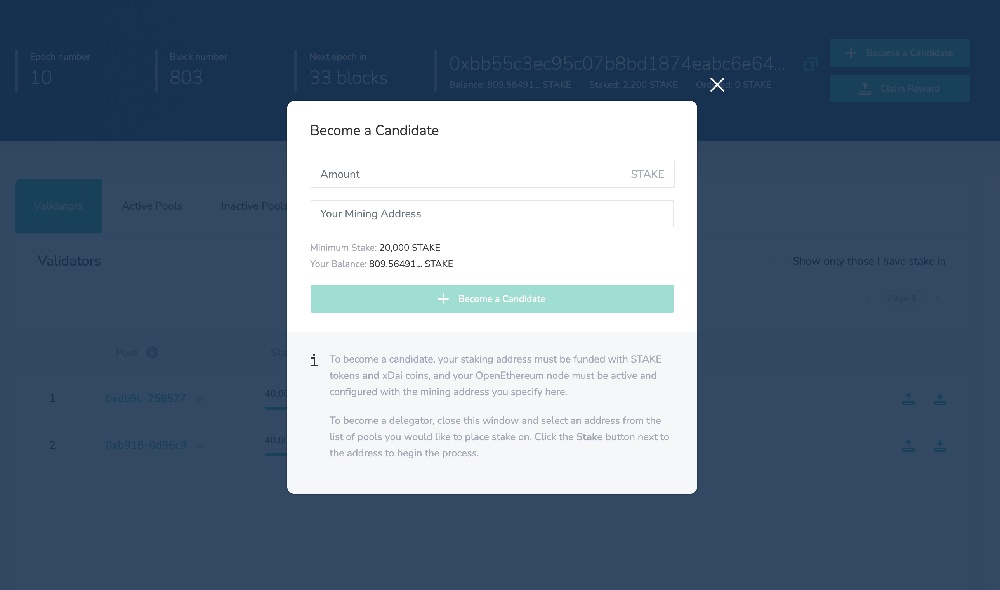

# Become a Candidate / Validator


POSDAO Public Staking is not here yet \(anticipated Q4 2020\), but we are gathering documentation related to the xDai staking processes. All pages in this section are currently under construction.  POSDAO is currently in[ phase 1, permissioned staking](../stake-and-staking/), and the current group of validators are functioning within this system.  
  
For staking available now, see [EasyStaking](../easy-staking/)


Validators are responsible for securing the xDai stable chain. Validator responsibilities include maintaining a functional node with constant uptime, providing STAKE as collateral, and providing decentralization to the protocol. In exchange for this service, validators receive block rewards and transaction fees.

Once phase 2 begins, additional validators and delegators will have the ability to onboard. To become a validator on the xDai stable chain, you must first become a candidate. Each staking epoch, 19 candidate pools are chosen to act as validators for that epoch. If there are 19 or fewer active candidates, then all active pools are selected. If there are more than 19, selection is based on total stake in the pool + a random number. [See this article for more info on weighting and randomness](https://forum.poa.network/t/reliable-randomness-bringing-on-chain-entropy-to-the-xdai-stable-chain/3015).


If you do not want to become a validator, but are interested in placing stake on other validators, see Become a Delegator


## Instructions


If you have any questions or concerns about becoming a candidate or validator, or experience any issues during setup, please contact us in [Discord](https://discord.com/invite/mPJ9zkq) or [our forum](https://forum.poa.network/c/xdai-chain/validators-intro/42).


1\) You will need the minimum candidate stake amount of STAKE \(currently 20,000 STAKE\) on xDai and a small amount of xDAI deposited to your address on the xDai chain. Deposit these to **your staking address** \(an 0x external address\). You will use to access the protocol. 

2\) In addition to your regular staking address, you will need a **separate mining address.** This ****will be configured to an OpenEthereum or Nethermind node. Generate and save the JSON keystore file \(and be sure to save the password in a safe place!\)

_**OpenEthereum Notes:**_ 

* Use version 3.0.0 or 3.0.1 **do not use the latest version of OpenEthereum as it does not support POSDAO**!
* You can generate a key with the following OpenEthereum's CLI command:

```text
openethereum account new --keys-path <path_to_save_json_keystore>
```

3\) Setup your node.

* [Nethermind](../../for-validators/new-validator-process-flow/nethermind-node-setup.md)
* [OpenEthereum: AWS](../../for-validators/node-deployment/aws-node-deployment-using-playbooks.md)
* [OpenEthereum: Non-AWS \(Manual setup\)](../../for-validators/node-deployment/manual-non-aws-deployment.md)

4\) Once your node is setup and ready, go to BlockScout and select Validators from the Apps dropdown menu.


5\) Set your web3wallet \(Metamask/Nifty\) account to your Staking address and connect to the app. Once connected, you should see your address and STAKE balance in the site banner. If you are a delegator, you will also see information related to any STAKE already in use \(staked or ordered for withdrawal\).


6\)  Click the **Become a Candidate** button. A modal will appear where you enter the amount of you initial STAKE \(20,000 minimum - you can add more now as well or more at a later time \) and the mining address of your node. 



7\) Once filled, click **Become a Candidate**. Submit and complete the transaction through the web3 wallet interface.

8\) If successful, your pool will appear in the **Active Pools** tab. You will be eligible to join the next staking epoch as a Validator! If there are more than 19 candidates, you will be chosen based on the total stake amount in your pool \(your stake + any delegators stake\) plus a random number.

