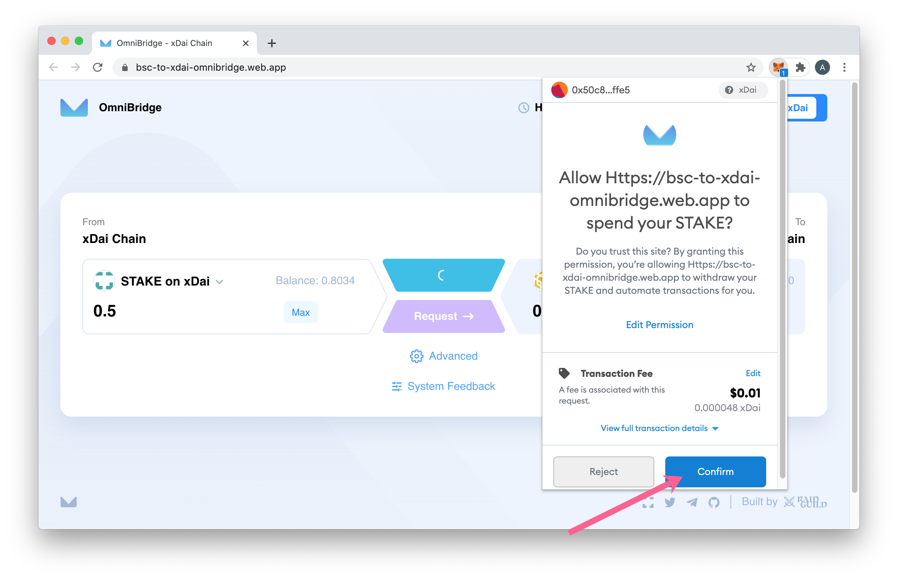
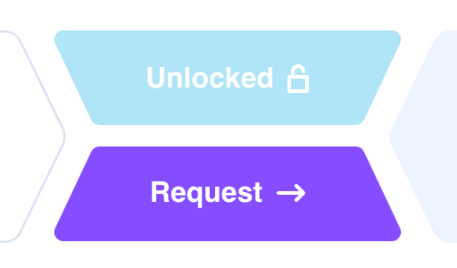
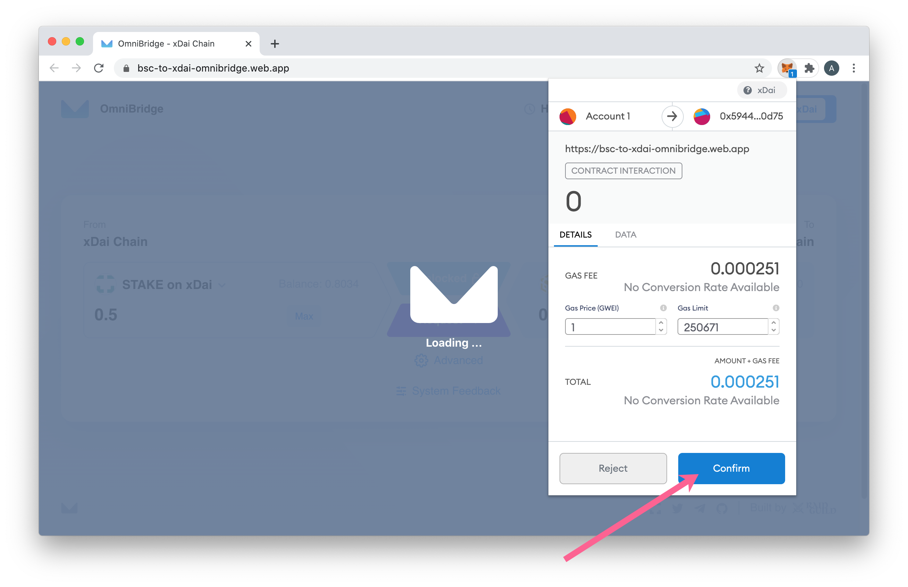
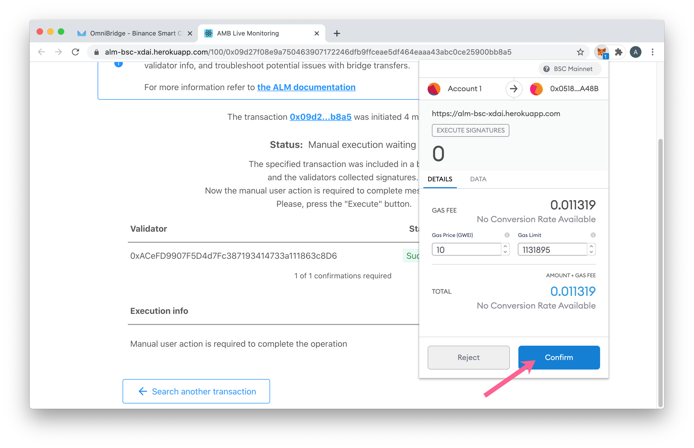
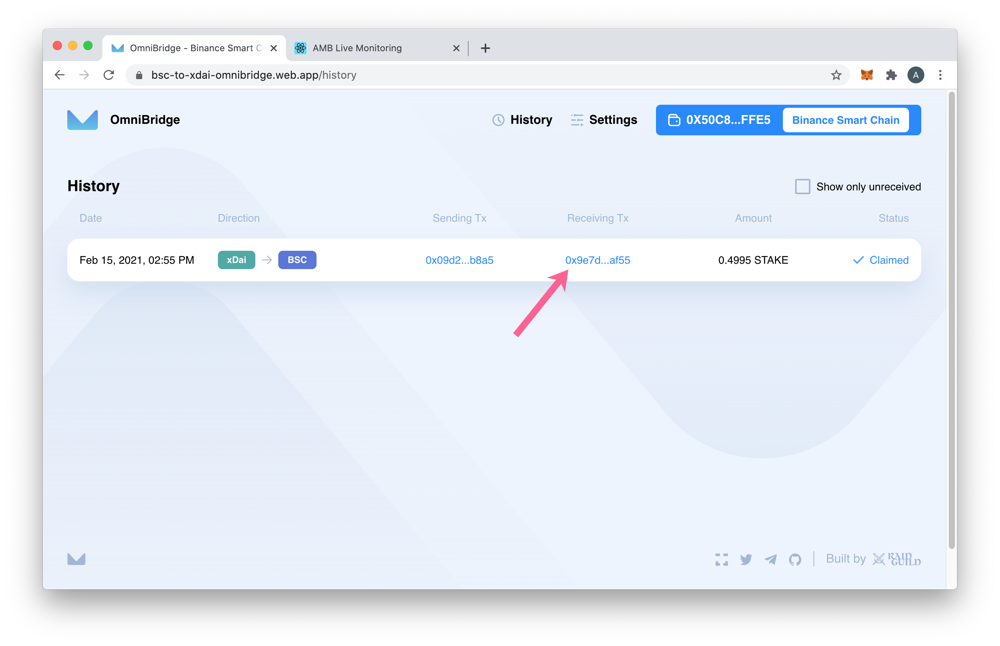
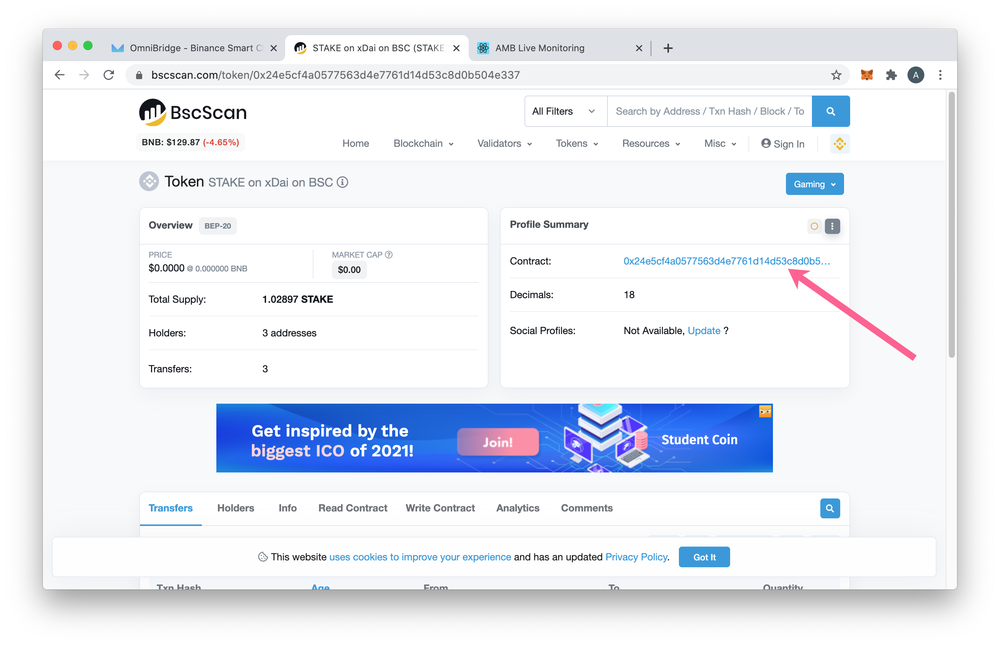
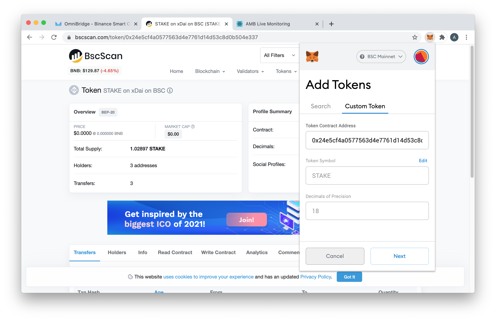

# BSC OmniBridge Example

Here we show the bridging steps to transfer STAKE on xDai to STAKE on BSC. The chain names are appended, so the bridged token is called "STAKE on xDai on BSC".

## What you need:

* A [token on the xDai chain](https://blockscout.com/xdai/mainnet/bridged-tokens/eth) you want to swap.
* A small amount of xDai to complete the transfer. [Use the faucet if you just need some for transactions](https://blockscout.com/xdai/mainnet/faucet).
* BNB on the Binance Smart Chain. If you have BNB on BEP2 you will need to swap it to BSC. [Trust Wallet](https://trustwallet.com/) works well for this \(however Trust Wallet does not yet support xDai, so once you swap you'll need to send BNB from your Trust Wallet to your BSC address in MetaMask for this tutorial\).
* MetaMask custom RPCs [setup for xDai](../../wallets/metamask/metamask-setup.md) and for the Binance Smart Chain \( Network Name: BSC Mainnet New RPC URL: [https://bsc-dataseed.binance.org/](https://bsc-dataseed.binance.org/) ChainID: 56 Symbol: BNB Block Explorer URL: [https://bscscan.com/](https://bscscan.com/)\) or find [more detailed instructions here](https://docs.binance.org/smart-chain/wallet/metamask.html).

## Bridge STAKE from xDai to BSC

1\) Go to [https://bsc-to-xdai-omnibridge.web.app/](https://bsc-to-xdai-omnibridge.web.app/).

1. Connect your web3 wallet to the xDai Network.
2. Select the token you want to bridge \(_note that token suffixes now specify which chain a token has been bridged from. Stake is now called STAKE from Ethereum rather than STAKE on xDai_\)
3. Select the amount.
4. Click Unlock \(_note click Settings to enable infinite unlocks from this address rather that unlocking a specific amount to transfer_\).

2\) Confirm the Unlock tx in MetaMask.

3\) Once Unlock tx is complete, Request button will become active. Click Request and Confirm in MetaMask.

4\) Wait for **Block Confirmations** and **Signature Collections**. Once complete, you will see the message to switch the network to the Binance Smart Chain.

5\) Once you switch networks, you will see the claim button.

1. Click to initiate claim the process. 
2. If the claim button does not work for some reason, you can click on the linked sending tx hash to process execute the transaction in the live monitor.

5a\) If using ALM, click on the Execute Button to finalize the claim.

6\) Once Claimed, you can click on the Receiving Tx to find your transaction on BscScan.



7\) To add STAKE to your BSC wallet, click on the Token Name, Copy the address, then go to custom token in MetaMask and add the address.

