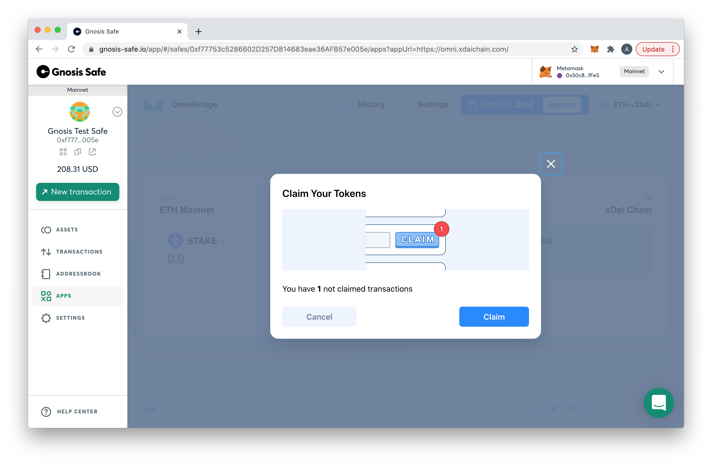

# OmniBridge + Gnosis Safe App

OmniBridge is compatible with the Gnosis Safe apps interface, allowing for bridge interaction with a multi-sig wallet. 


A Gnosis safe is deployed either to xDai chain or Ethereum. These safes are independent from one another and do not have the same contract addresses, so it is **important to use the Alternate Recipient Address feature** when bridging with a safe.

You will start the process on one chain \(Ethereum if bridging from Eth to xDai; xDai if bridging from xDai to Eth\). Once the first transaction is complete, you will switch to your Gnosis Safe on the chain you are bridging to, or claim using an alternative wallet on the receiving chain.


## Add the App

1\) Go to your Gnosis Safe and login and connect as you normally would. 

* Gnosis Safe on xDai: [https://xdai.gnosis-safe.io/](https://xdai.gnosis-safe.io/)
* Gnosis Safe on Ethereum: [https://gnosis-safe.io/app/](https://gnosis-safe.io/app/)

2\) Go to Apps -&gt; Add Custom App

3\) Add the App Url: [https://omni.xdaichain.com/](https://omni.xdaichain.com/). The App name should populate as OmniBridge. Agree to the terms and click Add.

4\) App will be added to the interface, click to access.

## Bridge App on Sending Chain: Initiating a Transaction

5\) Interact with the application as you normally would. You can begin the transfer process from the application. ****In this example we bridge from xDai to Ethereum.


Note that when bridging with a safe you want to set an alternate receiver. This may be a 2nd safe contract on the receiving chain or an individual address to receive the funds. **If you bridge without setting a different Recipient Address, your funds may be lost.**


To set, click on **Advanced**, then enter in the **0x address** into the Recipient Address box that will receive funds on the receiving chain. You can set a Gnosis safe address on the receiving chain as the recipient or another address. Complete the rest of the information \(token type and amount to transfer\) and click Request. If you need more details related to OmniBridge transfers, see the [OmniBridge Instructions Page](omnibridge/).

6\) Once you have requested the transfer, the required number of safe owners need to submit, sign and confirm.

## Bridge App on Receiving Chain: Claiming a Bridge Transaction

Once the initial transaction is processed through the application, you must switch to the receiving chain to claim. In this example, we sent STAKE from xDai to a Gnosis Safe address on Ethereum. To claim the transaction, login to Gnosis Safe and open the OmniBridge Application \(you may need to [add it using the steps above](omnibridge-+-gnosis-safe-app.md#add-the-app) if you have not added previously\)

7\) You should see the claim screen, click the **Claim** button to begin the process. If you do not see this screen, click on **History** at the top of the application.

8\) Click the **Claim** button.

9\) All required owners must confirm the transaction before it is processed. Once completed, the funds are added to the Safe.

