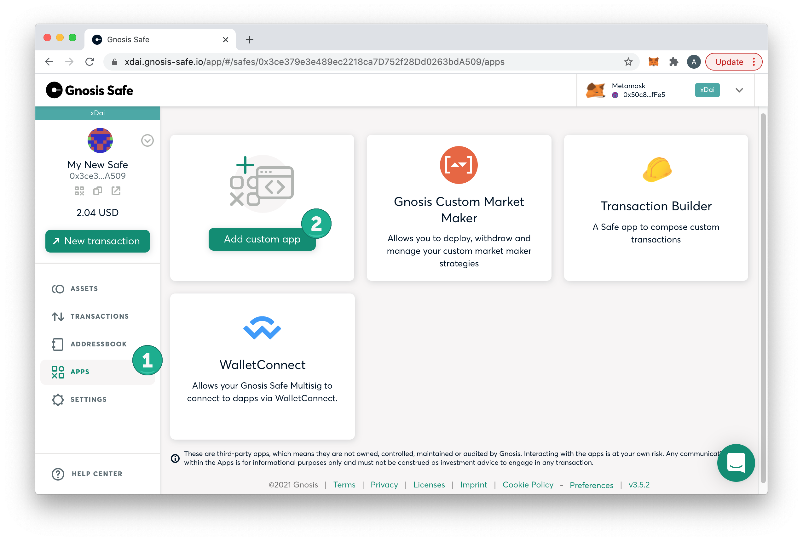
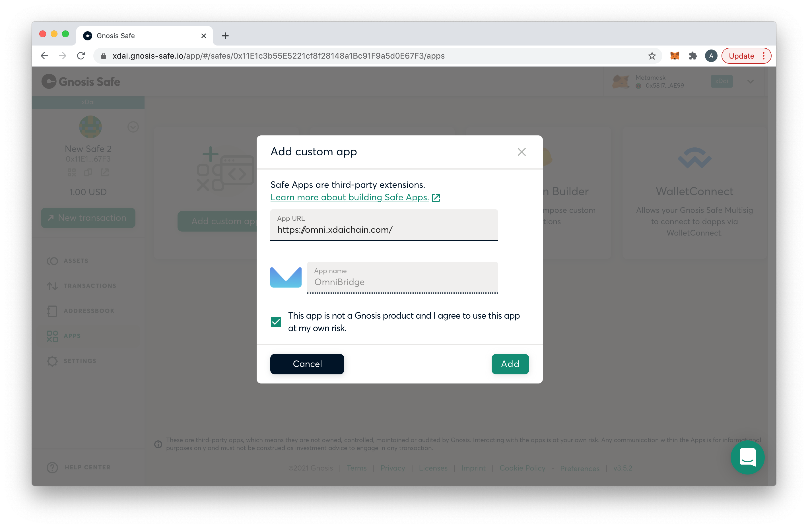
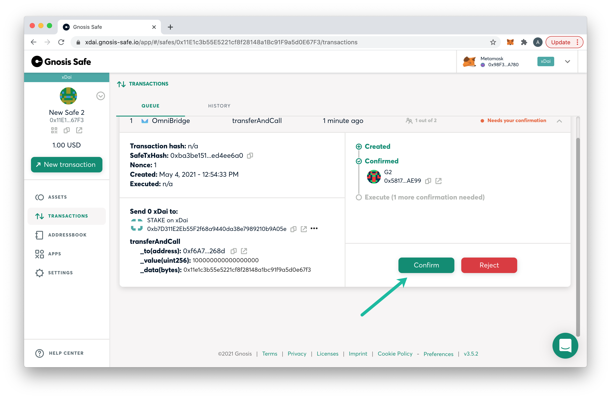
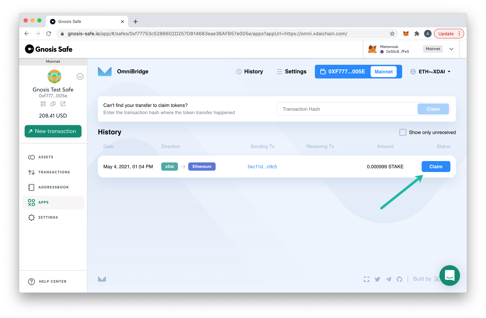
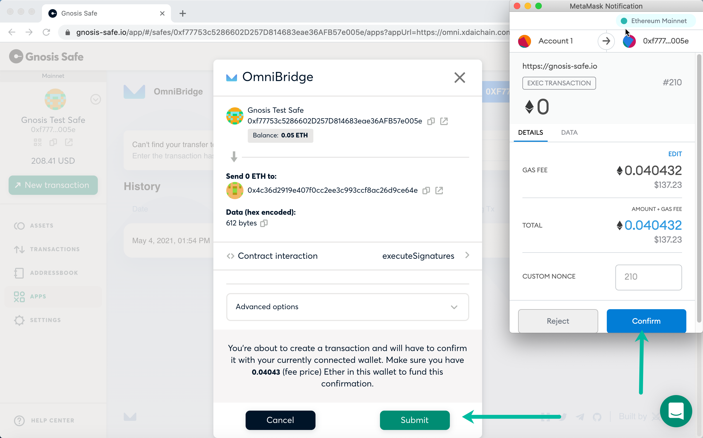

# OmniBridge + Gnosis Safe App

OmniBridge is compatible with the Gnosis Safe apps interface, allowing for bridge interaction and ERC20 transfers between xDai and Ethereum using a Multisig Wallet. The following instructions are for bridging **ERC20s between Ethereum and the xDai chain**. To transfer xDai to Dai and vice versa, see the [xDai Bridge + Gnosis Safe](../converting-xdai-via-bridge/xdai-bridge-+-gnosis-safe-app.md) instructions.


Each Gnosis Safe is deployed independently on the xDai chain and/or Ethereum. Cross-chain safes do not share the same contract addresses \(even when they have the same owners etc\), so it is **important to use the Alternate Recipient Address feature** when bridging with a safe.


## Add the App

1\) Go to your Gnosis Safe and login and connect as you normally would. 

* Gnosis Safe on xDai: [https://xdai.gnosis-safe.io/](https://xdai.gnosis-safe.io/)
* Gnosis Safe on Ethereum: [https://gnosis-safe.io/app/](https://gnosis-safe.io/app/)

2\) Go to Apps -&gt; Add Custom App

3\) Add the App Url: [https://omni.xdaichain.com/](https://omni.xdaichain.com/). The App name should populate as OmniBridge. Agree to the terms and click Add.

4\) App will be added to the interface, click to access.

## Bridge App on Origin Chain: Initiating a Transaction

5\) Open the application and interact with the bridge as you normally would to begin the transfer process. ****In this example we bridge from xDai to Ethereum.


Note that when bridging with a safe you will set an alternate receiver. This may be a 2nd safe contract on the receiving chain or an individual address to receive the funds. **If you bridge without setting a Recipient Address, your funds may be lost.**


To set an Alternate Recipient, click on **Advanced**, then enter in the **0x address** into the Recipient Address box that will receive funds on the receiving chain. You can set a Gnosis safe address on the receiving chain as the recipient or another accessible address. Complete the rest of the information \(token type and amount to transfer\) and click **Request**. If you need more details related to OmniBridge transfers, see the [OmniBridge Instructions Page](./).

6\) Once you have requested the transfer, the required number of safe owners need to submit, sign and confirm to process the request.

Once the first transaction is processed, close the safe application and switch chains to complete the claim. 

## Bridge App on Receiving Chain: Claiming a Bridge Transaction

In this example, we sent STAKE from xDai to a Gnosis Safe address on Ethereum. To claim this transaction, login to Gnosis Safe on Ethereum and open the OmniBridge Application \(you may need to [add it using the steps above](omnibridge-+-gnosis-safe-app.md#add-the-app) if you have not added previously\)

7\) You should see the claim screen, click the **Claim** button to begin the process. If you do not see this screen, click on **History** at the top of the OmniBridge app.

8\) Click the **Claim** button.

9\) All required owners must confirm the transaction before it is processed. Once completed, the funds are added to the Safe.

