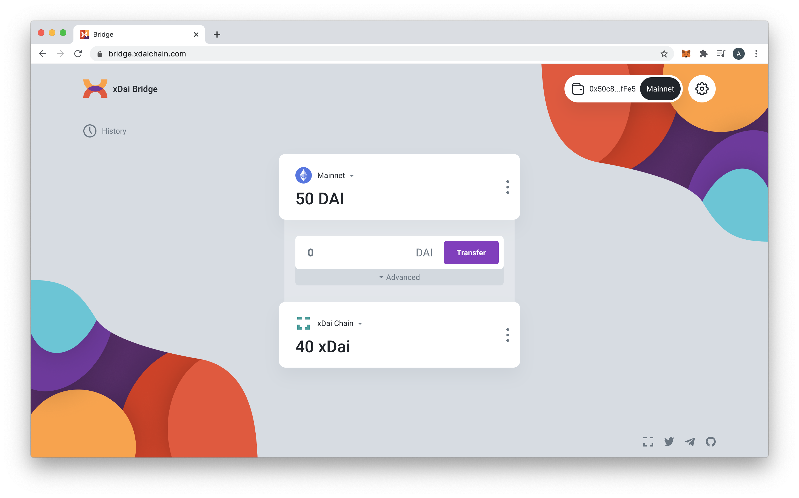
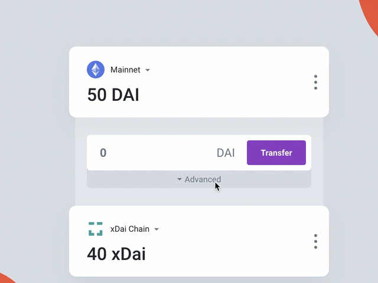
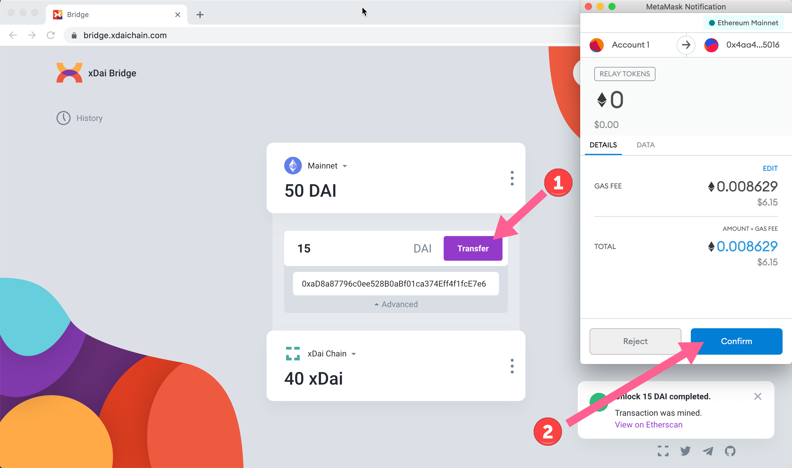
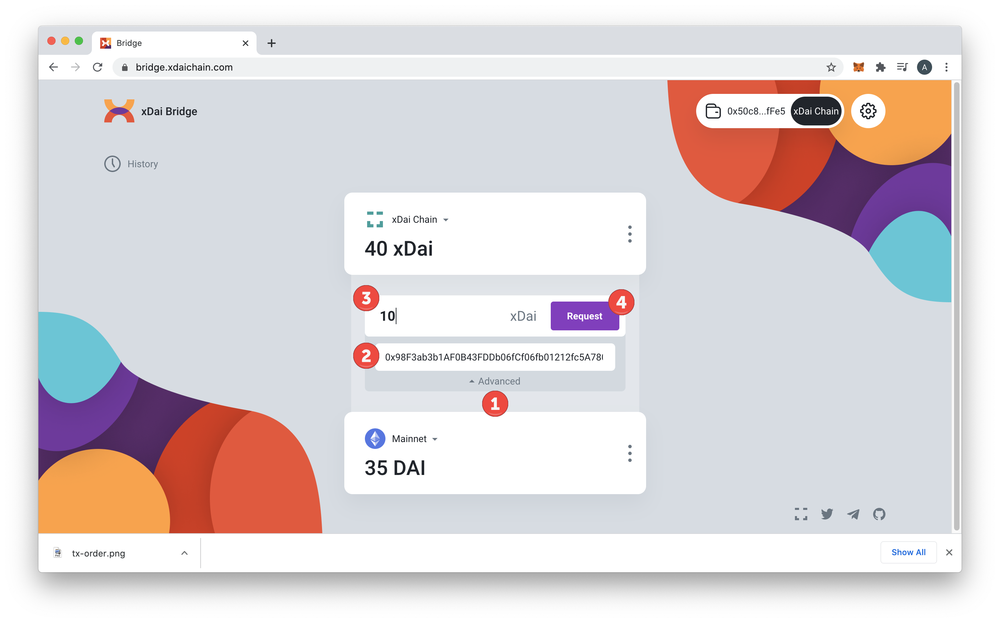
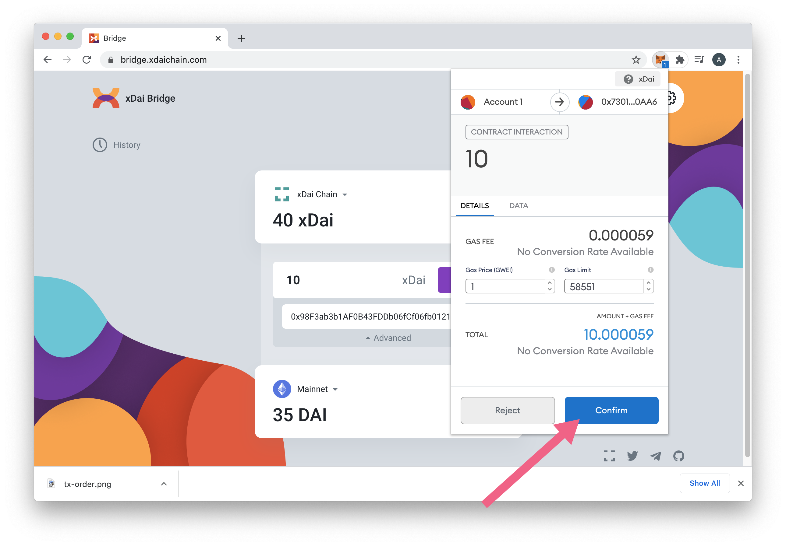
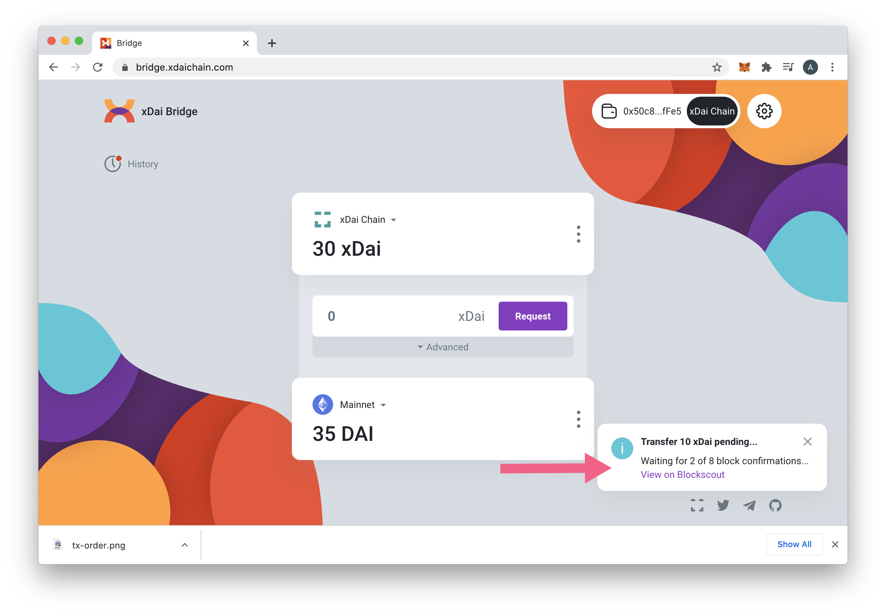
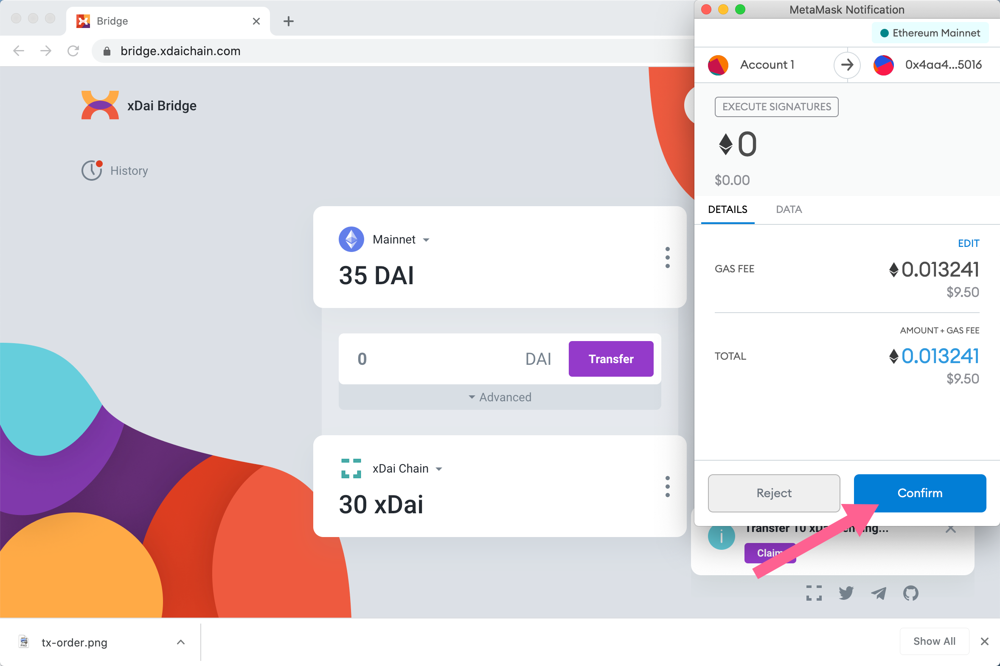

# Alternate Receiver \(Send Dai to another xDai address\)

The new feature _Alternative Receiver_ has integrated in the contracts of the xDai bridge as part of [the recent contracts upgrade](https://forum.poa.network/t/migration-of-the-xdai-tokenbridge-completed/3212). With this feature it becomes possible to transfer tokens through the bridge to any account by very simple actions. It means that Alice can send Dai to Bob’s account on the xDai chain in one transaction, and Bob can send xDai to Clare’s account on the Ethereum Mainnet in one transaction too.

Due to different nature of tokens on two sides of the xDai bridge the operations to transfer assets to an alternative receiver from one chain to another differ as well.

## Alternative Receiver in Bridge UI

The latest bridge UI upgrade incorporates the Alternative Receiver functionality. The transfer requires 2 transactions, one to unlock the contract and a second to process the transaction. _Manual methods are described below this section._

### Dai to xDai

1\) Go to [bridge.xdaichain.com](https://bridge.xdaichain.com/) and connect your MetaMask Wallet.



2\) Determine **Single Tx Unlock** or **Infinite Tx Unlock**.  You may want to approve the transfer for a single transaction, or approve the contract to make unlimited transfers from this address to many other addresses. For a Single TX Unlock, proceed directly to step 3 below. For infinite TX unlock, complete the following.

2a\) Go to Settings:


2b\) Toggle Infinite Unlock and save. Close the modal and proceed to step 3.


3\) Click on **Advanced** and add the Recipients Address and the amount to Dai to transfer to xDai. Press **Unlock.**



4\) Confirm the Unlock transaction in MetaMask.


5\) Click to Transfer and Confirm the transaction.



6\) Once the initial transaction is successful, you will see consecutive Transfer Pending notifications with:

1. 8 of 8 block confirmations.....
2. Countdown with continue until 1 block confirmation is left.
3. Waiting for execution on xDai Chain side.
4. Transfer Complete.


7\) The transfer is complete. Check the balance of the new account by clicking on the BlockScout link or accessing the address on xDai.

### xDai to Dai

With xDai to Dai transfers you do not need to use the Unlock feature. Connect to the xDai Chain in MetaMask.

1. Click on Advanced.
2. Enter the Address that will receive Dai.
3. Enter Amount.
4. Click Request.



2\) Click Confirm to acknowledge you will need to perform 2 transactions.


3\) Confirm the first tx in MetaMask.



4\) Wait for 8 Block Confirmations on xDai.



5\) Switch to **Ethereum Mainnet** in MetaMask. The Claim button will appear. Click **Claim**.


6\) **Confirm** the second claim transaction in MetaMask. Once processed, the Dai should be available for the alternative receiver on Ethereum.



## Dai to xDai \(Manual, Non-UI Method\)

1. Open MetaMask and choose the Ethereum Mainnet.

2. Go to the Dai Token Contract -&gt; Write Contract functionality in Etherscan.  
[https://etherscan.io/address/0x6b175474e89094c44da98b954eedeac495271d0f\#writeContract](https://etherscan.io/address/0x6b175474e89094c44da98b954eedeac495271d0f#writeContract)

3. Connect to your Web3Wallet \(MetaMask\).


4. Approve the bridge contract to perform operations with tokens:

* `usr(address)` -- the address of the xDai bridge contract in the Ethereum Mainnet: `0x4aa42145Aa6Ebf72e164C9bBC74fbD3788045016`
* `wad(uint256)` -- the amount of tokens \(in Wei\) approved to send through the bridge \(in this case 2 Dai\): `2000000000000000000`
* Click **Write**


4. Confirm the transaction in the MetaMask and wait until it is included in the chain.


5. Initialize the xDai bridge contract interface in Etherscan. Here you will write to the proxy contract. [https://etherscan.io/address/0x4aa42145aa6ebf72e164c9bbc74fbd3788045016\#writeProxyContract](https://etherscan.io/address/0x4aa42145aa6ebf72e164c9bbc74fbd3788045016#writeProxyContract)

6. You will see several  `relayTokens` methods. Use Method \(1\) to send to an alternate address. You can also use a second method \(14\) if the Dai deposit is performed by another contract of behalf of the user account \(like a DEX\). There are also 2 other relayToken methods \(4\), \(22\) that specify a `_token(address)`. These are not in use.

**relayTokens Method \(1\)**

* `_receiver (address)` - address of the alternate receiver, the account that will be sent native tokens on the xDai chain
* `_amount (uint256)` - the amount of tokens \(in Wei\) to transfer; must be less or equal amount of tokens approved for the bridge operations
* Click **Write**

**relayTokens Method\(14\)**

* `_sender (address)` - optional. Use when the Dai deposit is performed by another contract on behalf of a user account \(e.g. by a DEX\)
* `_receiver (address)` - address of the alternate receiver, the account that will be sent native tokens on the xDai chain
* `_amount (uint256)` - the amount of tokens \(in Wei\) to transfer; must be less or equal amount of tokens approved for the bridge operations
* Click **Write**


7. Submit the transaction in the MetaMask and wait until it is included in the chain.

8. The xDai bridge will take some time to relay the deposit request to the xDai chain. Once complete, the balance of the `_receiver`account will increase with the corresponding amount of xDai.

## xDai to Dai \(Non-UI Method\)


Since Etherscan does not currently support xDai, we use MyEtherWallet for this example. You may also try Nifty Wallet.  
  
Due to some xDai chain / MEW compatibility issues, this method may trigger an error. It does work when initiated in a contract call. We present here for illustrative purposes, as the method is different \(and simpler\) than the Dai -&gt; xDai transfer. 


1. Choose the xDai chain in the browser wallet extension and login to [MyEtherWallet \(MEW\)](https://www.myetherwallet.com/access-my-wallet). Ensure you have some xDai to send.

2. Initialize the xDai bridge contract interface: enter the bridge contract address `0x7301CFA0e1756B71869E93d4e4Dca5c7d0eb0AA6` and the following JSON in the **`ABI/JSON Interface`** field:

```javascript
[{"type":"function","stateMutability":"payable","payable":true,
"outputs":[],"name":"relayTokens","inputs":[{"type":"address",
"name":"_receiver"}],"constant":false}]
```


3. Prepare the call of `relayTokens` method:


* `_receiver` -- the account that will get Dai tokens on the Ethereum Mainnet
* `Value in ETH` -- the amount of native tokens \(in Ether - NOT WEI!\) to transfer

4. Submit the transaction in your web3wallet and wait until it is included in the chain.

5. The xDai bridge will take some time to relay the withdrawal request to the Ethereum Mainnet. Eventually the receiver's Dai account balance will increase. 

